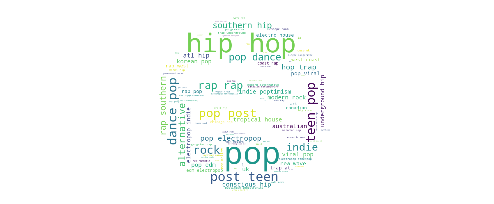
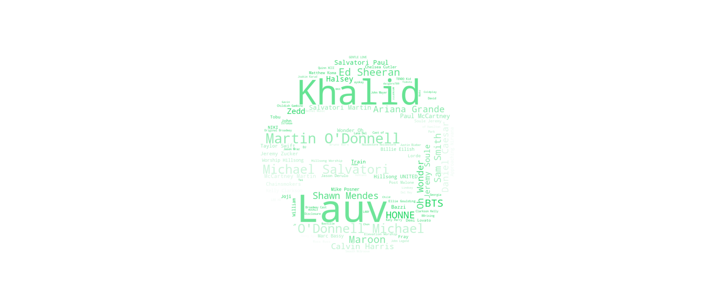

# SpotifyScraper
**A Spotify scraper for visualizing listening data via the Spotify Web API**

## Demo

  
<i>Genre WordCloud</i>
 

  
<i>Artist WordCloud</i>
 

## Tech
- **Fetching Data**
  - [Spotify Web API](https://developer.spotify.com/documentation/web-api/)
  - [spotipy](https://spotipy.readthedocs.io/en/2.12.0/) (Python Wrapper)
- **Data Analysis/Visualization**
  - [numpy](https://numpy.org/)
  - [WordCloud](https://amueller.github.io/word_cloud/)
  - [Matplotlib](https://matplotlib.org/)

### Resources
  - [Duong Vu's WordCloud Tutorial](https://www.datacamp.com/community/tutorials/wordcloud-python)
